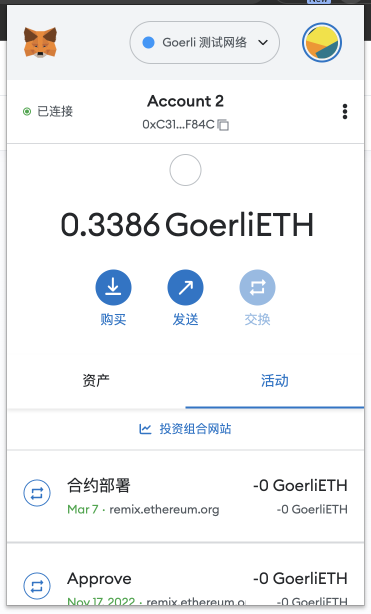
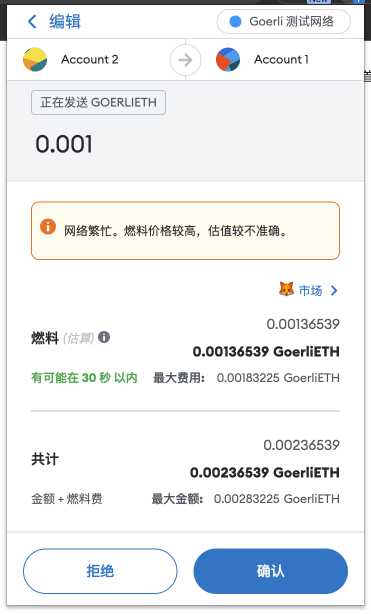
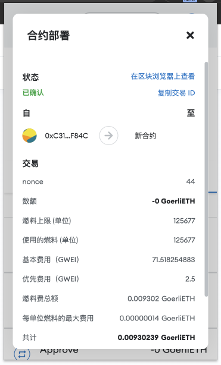

## 1.安装小狐狸插件



## 2.获取账户地址
此处获取了2个测试网账户地址

1. 地址1: 0xC3106642437E8657829045BA4299D846E333F84C
2. 地址2: 0x5C92Fcc2cB8Ea627Dd3FC830F62B9ab75B43FC93

并且分别获区测试币

## 3.使用地址1向地址2转账



此笔交易在测试网中的交易hash为[0x2038301d902de80dec333e3ae45124acd507da235af47219304d64aeb522cfea](https://goerli.etherscan.io/tx/0x2038301d902de80dec333e3ae45124acd507da235af47219304d64aeb522cfea)


## 4.编写Counter.sol合约

``` solidity

// SPDX-License-Identifier: GPL-3.0

pragma solidity >=0.8.2 <0.9.0;

contract Counter {
    uint public counter;

    constructor (){
        counter = 0;
    }
    
    function count() public {
        counter = counter + 1;
    }

    function add(uint x) public{
         counter = counter + x;
    }

}
``` 



合约的部署hash为[0x5891c036e60e6c3db1bf698c44d725c6778c1fc8e465096e040a7bb48593b3f2](https://goerli.etherscan.io/tx/0x5891c036e60e6c3db1bf698c44d725c6778c1fc8e465096e040a7bb48593b3f2)

